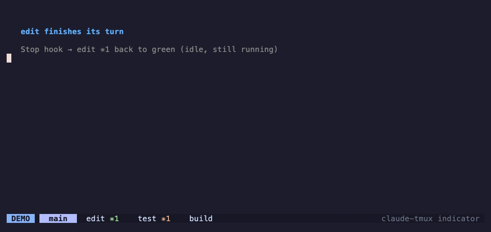

# tmux claude-agent indicator

Shows a per-window `✳N` in the tmux status bar: N = number of live Claude Code agents
in that window. **Orange** while any agent is busy, **green** when all are idle/finished,
nothing when the window has no agents.

## Demo


A scripted agent lifecycle across four windows: an agent launches (green `✳1`), starts
working (orange), a second agent joins, the first goes idle then exits, the indicator
clears. Below, `edit` is idle (green) while `test` is busy (orange) at the same time:



## How it works

Two writers, one reader:

- **`claude-tmux-count.sh`** (poller) runs every `status-interval` (5s) via a hidden `#()`
  in `status-right`. One `ps` snapshot + process-tree walk → sets window option
  `@claude_count`. Also clears stale `@claude_pane_busy` flags whose claude process is gone
  (recovers from `kill -9`).
- **`claude-tmux-hook.sh busy|idle`** runs on Claude Code lifecycle events and sets the
  pane flag `@claude_pane_busy` instantly from `$TMUX_PANE`, then recomputes the window
  display flag `@claude_busy`. No-op outside tmux.
- The catppuccin **window-text format** only reads `@claude_count` / `@claude_busy` — no
  per-window shell-out.

Detection counts claude anywhere in a pane's process tree (catches nested cases such as
claude inside an nvim `:terminal`); a claude child of another claude is not double-counted.

**Option naming:** the per-pane flag is `@claude_pane_busy`, distinct from the window
display flag `@claude_busy`. tmux user options resolve up the pane→window hierarchy, so
reusing one name at both scopes would make an unset pane inherit the window value and the
busy recompute would feed back on itself.

## Install

This directory is self-contained and portable — copy it anywhere (clone the repo, or just
drop the four files: the two scripts, `tmux.snippet.conf`, `install.sh`) and run:

```bash
./install.sh
```

`install.sh` is idempotent and does the three wiring steps for you:

1. symlinks `claude-tmux-hook.sh` into `${CLAUDE_CONFIG_DIR:-~/.claude}/scripts/`,
2. merges the `UserPromptSubmit` / `Stop` / `SessionEnd` hooks into that dir's
   `settings.json` (via `jq`, preserving any existing hooks for those events),
3. appends the marker-guarded indicator block to `${TMUX_CONF:-~/.tmux.conf}`, with the
   poller path resolved to wherever this directory actually lives.

Then `tmux source-file ~/.tmux.conf`. Hooks take effect on the **next** Claude Code session.

Path overrides for non-default layouts:

```bash
CLAUDE_CONFIG_DIR=~/.config/claude TMUX_CONF=~/.config/tmux/tmux.conf ./install.sh
```

**Dependencies:** `tmux`, `bash`, `ps`, `awk`, `grep` (the scripts), `jq` (settings merge;
without it the installer prints the JSON to add by hand), and — for the default colored
format — the [`catppuccin/tmux`](https://github.com/catppuccin/tmux) theme. For a
non-catppuccin setup, see the comment in `tmux.snippet.conf` for a theme-agnostic
`status-right` variant.

The scripts read no absolute paths of their own; the only host-specific values
(`MODULE_DIR`, `CLAUDE_CONFIG_DIR`, `TMUX_CONF`) are resolved at install time.

## Manual test checklist

1. Start an agent in a window → green `✳1` appears within ~5s.
2. Send a prompt → flips orange instantly.
3. Agent finishes responding → flips green instantly.
4. Start a second agent in the same window → `✳2`.
5. `kill -9` a busy claude → indicator clears within ~5s (stale cleanup).
6. Start claude outside tmux → no errors, no indicator.
7. `tmux source-file ~/.tmux.conf` → options and format survive reload.

## Latency

| Signal | Source | Latency |
|---|---|---|
| Agent appears / disappears | poller | ≤ 5s |
| Busy ↔ idle | hook | instant |
| Stale busy after `kill -9` | poller | ≤ 5s |

## Removal

```bash
./uninstall.sh
```

Reverses all three install steps (idempotent): removes the hook symlink, strips the three
hook entries from `settings.json` (dropping any event arrays it empties, leaving unrelated
hooks intact), and deletes the marker-guarded block from the tmux config. Honors the same
`CLAUDE_CONFIG_DIR` / `TMUX_CONF` overrides. Then `tmux source-file ~/.tmux.conf`.

> Note: `uninstall.sh` only removes the **marker-guarded** tmux block written by
> `install.sh`. A pre-existing manual poller line (no markers) is left untouched — remove it
> by hand.

## Regenerating the demo

The GIF is reproducible. It runs the real `claude-tmux-count.sh` + `claude-tmux-hook.sh`
against scripted stand-in agents (a symlink named `claude` → `/bin/sleep`, which `ps`
reports as `claude`, so the poller counts it like the real thing), on a **dedicated tmux
socket** that never touches your live session.

```bash
brew install vhs        # one-time (also installs ffmpeg + ttyd)
vhs demo.tape           # writes assets/demo.gif and assets/demo.mp4
```

Preview the choreography live (no recording) with `bash demo/launch.sh`. The pieces live in
`demo/`: `launch.sh` (dedicated-socket launcher), `demo.tmux.conf` (theme-agnostic config
that folds the `✳` into `window-status-format`), and `demo.sh` (the lifecycle script).
